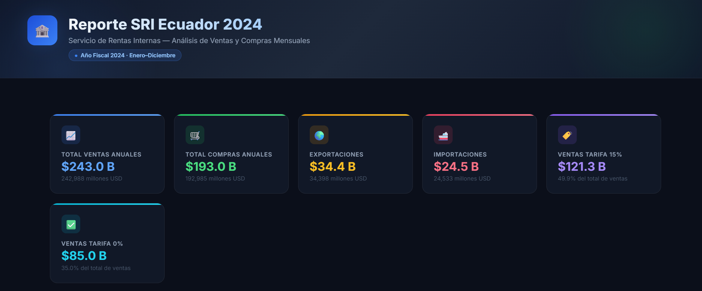
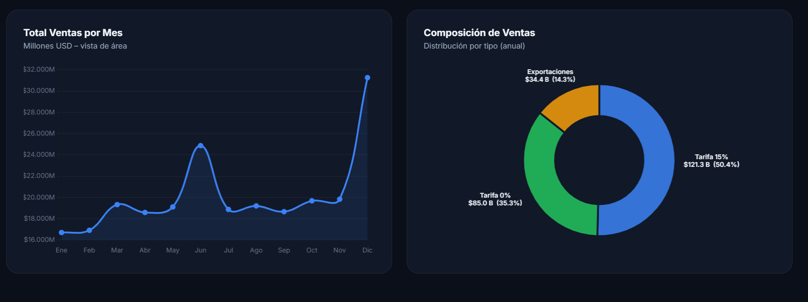
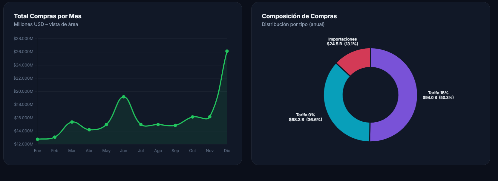
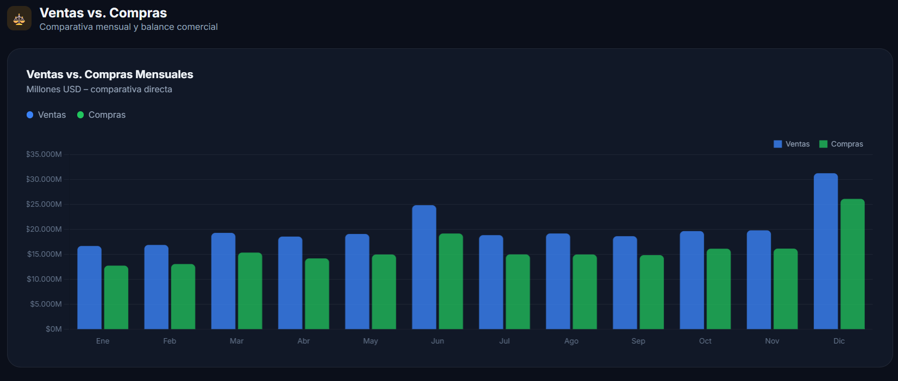

> **¿Cómo se comportaron las ventas y compras declaradas ante el SRI en Ecuador durante 2024?** Este análisis explora el volumen mensual de transacciones gravadas, las diferencias por tipo de tarifa (15% y 0%), exportaciones e importaciones, y el desempeño comercial por provincia y sector económico.

🚀 **Proyecto destacado para mi portafolio como Analista de Datos.**

🔗 *Ver el reporte interactivo:*  
[reporte_sri_2024.html](./reporte_sri_2024.html)

---

## 🎯 Objetivo del Proyecto

Este análisis tiene como objetivo identificar patrones, tendencias y volúmenes de actividad comercial declarados ante el **Servicio de Rentas Internas (SRI) del Ecuador** durante el ejercicio fiscal **2024**, a partir de los datos oficiales de ventas y compras netas. El enfoque está en comparar la evolución mensual, la composición por tipo de tarifa IVA, y el desempeño por provincia y sector económico.

---

## 🧩 Metodología y Herramientas

- **Fuente de datos:** Servicio de Rentas Internas del Ecuador (SRI) – Dataset de Ventas y Compras 2024
- **Registros procesados:** 49,852 filas × 14 columnas
- **Lenguaje de procesamiento:** Python
- **Bibliotecas:** Pandas
- **Visualización:** HTML + JavaScript (Chart.js, chartjs-plugin-datalabels)
- **Proceso:**
  1. **Extracción:** Lectura del CSV oficial del SRI con separador `|` y codificación `latin-1`.
  2. **Limpieza:** Conversión de tipos numéricos con decimales en coma, verificación de meses completos (1–12).
  3. **Transformación:** Agregación mensual, ranking de provincias (Top 10) y análisis de sectores económicos (código CIIU nivel 1).
  4. **Visualización:** Generación de un reporte HTML interactivo con 9 gráficas: barras apiladas, áreas, donas con etiquetas siempre visibles, barras comparativas y balance comercial.

---

## 📊 Principales Hallazgos

### 1. 🏦 Totales Generales del Año Fiscal 2024



- **Total anual de ventas:** $242,988 millones USD (≈ $243 B)
- **Total anual de compras:** $192,985 millones USD (≈ $193 B)
- **Exportaciones:** $34,398 millones USD · **Importaciones:** $24,533 millones USD
- Las ventas a Tarifa 15% representaron el **49.9%** del total, y las ventas a Tarifa 0% el **35.0%**.

---

### 2. 📈 Evolución Mensual de Ventas


- **Diciembre** fue el mes de mayor actividad con **$31,258 millones**, reflejando el cierre del ejercicio fiscal.
- **Junio** registró un pico atípico de **$24,866 millones**, probablemente vinculado a cierres contables semestrales.
- **Enero y Febrero** presentaron los volúmenes más bajos del año (~$16,700 M), consistente con el inicio de año fiscal.
- La **Tarifa 15%** (azul) domina en todos los meses, seguida de la Tarifa 0% (verde) y Exportaciones (naranja).

---

### 3. 📉 Total de Ventas por Mes y Composición por Tipo



- La curva de área refuerza visualmente los picos de Junio y Diciembre.
- La dona de composición muestra que **Tarifa 15%** concentra el **50.4%**, Tarifa 0% el **35.3%** y Exportaciones el **14.3%** del total anual de ventas.

---

### 4. 🛒 Evolución Mensual de Compras


- **Total anual de compras:** $192,985 millones USD.
- La tendencia de compras siguió de cerca a la de ventas, con un **superávit comercial anual de ~$50,003 millones**.
- Diciembre concentró el mayor gasto en compras ($26,124 M), seguido de Junio ($19,197 M).
- La **Tarifa 15%** (morado) lidera en compras, con las importaciones (rojo) como componente más pequeño.

---

### 5. 🔄 Total de Compras por Mes y Composición por Tipo



- La curva verde de compras refleja el mismo patrón estacional que las ventas.
- En la composición anual de compras: **Tarifa 15%** representa el **50.3%**, Tarifa 0% el **36.6%** e Importaciones el **13.1%**.

---

### 6. ⚖️ Ventas vs. Compras Mensuales



- En **todos los meses** las ventas superaron a las compras, confirmando un **superávit comercial sostenido** a lo largo del año.
- El mayor superávit se registró en **Diciembre ($5,133 M)** y el menor en **Febrero ($3,821 M)**.
- El pico de Junio evidencia un incremento simultáneo en ventas y compras, posiblemente por cierres de semestre fiscal y campañas comerciales.

---

### 7. 🗺️ Ventas y Compras por Provincia (Top 10)

.png)

- **Pichincha ($93.2 B)** y **Guayas ($85.2 B)** concentran el **73.3%** del total de ventas del país, reafirmando la centralización económica en Quito y Guayaquil.
- **Manabí ($10.6 B)** y **Azuay ($9.4 B)** se posicionan como tercera y cuarta economía provincial.
- **Zamora Chinchipe ($3.3 B)** destaca con un superávit comercial alto relativo a su tamaño, posiblemente ligado a la actividad minera.
- La brecha entre Pichincha/Guayas y el resto del país es marcada, evidenciando una alta concentración económica.

---

## 💡 Conclusiones y Recomendaciones

- **Concentración geográfica:** Existe una marcada dependencia económica en Pichincha y Guayas, lo que plantea riesgos de resiliencia ante eventos adversos focalizados en esas regiones.
- **Picos estacionales:** Los meses de Junio y Diciembre requieren mayor capacidad operativa y de control tributario por parte del SRI, dado su comportamiento atípico.
- **Tarifa 0% con alto peso:** Más de un tercio de las ventas son a tarifa cero, lo que tiene implicaciones directas para la recaudación de IVA y las políticas de exenciones vigentes.
- **Superávit constante:** El balance positivo mensual sostenido sugiere que el sector productivo formal genera más de lo que consume, lo que es un indicador de salud económica relativa.
- **Oportunidad para provincias intermedias:** Tungurahua, Los Ríos y Esmeraldas presentan actividad relevante y podrían ser foco de políticas de fomento productivo regional.

---

## 🗂️ Estructura del Repositorio

```
reporteSRI2024/
│
├── DataSet/
│   └── sri_ventas_2024.csv          # Dataset original del SRI (49,852 registros)
├── capturasResultados/
│   ├── TotalesGenerales.png
│   ├── Evolución Mensual de Ventas.png
│   ├── TotalVentasPorMes-DistribucionVentasPorTipo.png
│   ├── Evolución Mensual de Compras.png
│   ├── TotalComprasPorMes-DistribucionComprasPorTipo.png
│   ├── VentasVsCompras-Mensuales.png
│   └── Ventas y Compras por Provincia (Top 10).png
├── reporte_sri_2024.html            # Reporte interactivo con 9 gráficas (Chart.js)
└── README.md                        # Este archivo
```

---

## 🚀 ¿Por qué este proyecto?

Este análisis demuestra mi capacidad para trabajar con **datos oficiales de gran volumen**, transformarlos eficientemente con Python/Pandas y comunicar los resultados a través de **visualizaciones interactivas de alto impacto** — sin depender de herramientas de BI de terceros. Es un reflejo de mi enfoque end-to-end como analista de datos: desde la fuente cruda hasta la historia que los números cuentan.

## 🙋‍♂️ ¿Tienes preguntas?

¡Me encantaría saber tu opinión! ¿Qué otro ángulo del análisis te gustaría explorar? ¿Comparativa entre sectores CIIU? ¿Análisis de evasión estimada? ¿Desglose cantonal? ¡Escríbeme!

---

> **Creado con ❤️ por Ronny Solis | Analista de Datos**  
> [\[LinkedIn\]](https://www.linkedin.com/public-profile/settings?trk=d_flagship3_profile_self_view_public_profile) | ronnytrabajo@gmail.com
